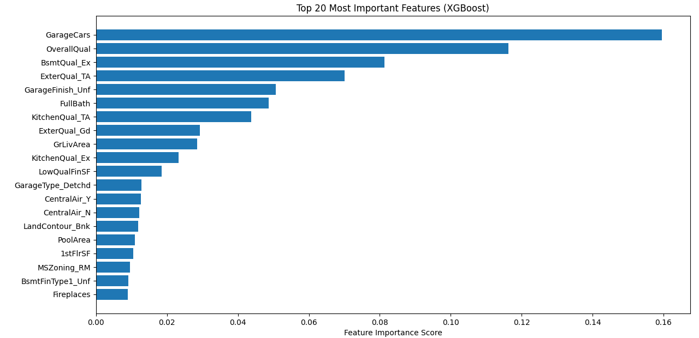

# House Price Prediction (Regression) — XGBoost + Full ML Pipeline

This project implements an end-to-end machine learning pipeline to predict housing prices using the popular **Kaggle House Prices – Advanced Regression Techniques** dataset.  
The workflow includes data preprocessing, feature engineering, model training with XGBoost, evaluation, and inference on unseen test data.

---

## Project Highlights

- Complete ML pipeline using **scikit-learn** (`ColumnTransformer`, `OneHotEncoder`, `SimpleImputer`)
- Trained **XGBoost Regressor** with strong performance  
- Automatic handling of missing values (numeric → median, categorical → mode)  
- Full One-Hot Encoding applied consistently to both train and test  
- Model export using `joblib`  
- Separate inference script generates Kaggle-ready `submission.csv`
- Feature importance visualization (`xgb_feature_importance.png`)

---

## Model Performance (Validation Set)

| Metric | Score |
|--------|--------|
| **RMSE** | **25,384** |
| **R²** | **0.9160** |

The XGBoost model significantly outperformed the baseline Random Forest (RMSE ≈ 28.7k, R² ≈ 0.89).

---

## Top Features (XGBoost Importance)

XGBoost identified the following as the most influential predictors of home sale price:

- `GarageCars`
- `OverallQual`
- `BsmtQual_Ex`
- `ExterQual_TA`
- `FullBath`
- `GrLivArea`
- `KitchenQual_TA`
- `GarageFinish_Unf`
- …and more

These reflect structural quality, garage capacity, living area, and overall home condition.

 **Visualization:**  


---

## Project Structure

```
House-Price-Prediction/
│
├── Data/
│    ├── train.csv
│    ├── test.csv
├──src/
│    ├── train_model_xgb.py
│    ├── predict_on_test_pipeline.py
│    ├── feature_importance_xgb.py
│
├── model_xgb_pipeline.pkl  ( trained model )
├── submission_xgb_pipeline.csv
├── xgb_feature_importance.png
│
└── README.md
```

---

## Installation

```bash
pip install -r requirements.txt
```

Typical required libraries:

```
pandas
numpy
scikit-learn
xgboost
matplotlib
joblib
```

---

## Training the Model

```bash
python train_model_xgb.py
```

This script will:

- Load `train.csv`
- Automatically preprocess numerical & categorical data
- Train XGBoost Regressor in a Pipeline
- Evaluate on a validation split
- Save the full pipeline model to:  
  `model_xgb_pipeline.pkl`

---

## Making Predictions (Test Set)

```bash
python predict_on_test_pipeline.py
```

This script will:

- Load `test.csv`
- Apply the same preprocessing steps (via the pipeline)
- Generate predicted sale prices
- Save results to:  
  `submission_xgb_pipeline.csv`

This file is ready for Kaggle submission.

---

## Visualizing Feature Importance

```bash
python feature_importance_xgb.py
```

This generates and saves:  
`xgb_feature_importance.png`

---

## Technologies Used

- Python 3.10
- scikit-learn
- XGBoost
- Pandas & NumPy
- Matplotlib
- Joblib

---

## Results Summary

This project produces a strong regression model with **R² ≈ 0.92**, demonstrating good ability to explain variance in housing prices.  
The pipeline ensures reproducible, clean, and scalable machine learning workflow suitable for production or Kaggle competition use.

---

## Author

Omar Hatem Ellaban | 
Machine Learning & Deep Learning Engineer  

Feel free to fork, improve, or contact for collaborations!

